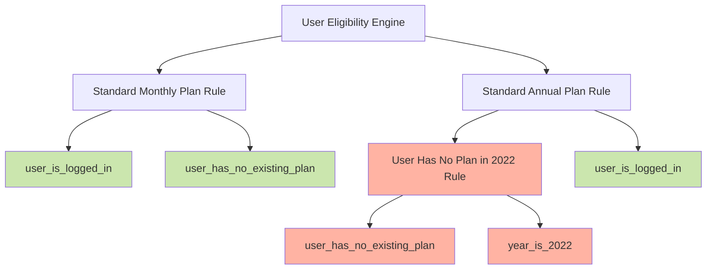

#

<br />
<br />
<br />
<br />
<br />
<br />
<br />
<br />
<br />
<br />

[bit.ly/wbd-ato22](https://bit.ly/wbd-ato22)

::right::


---
layout: cover
background: "/images/fotografiska.jpeg"
download: true
---

# The Power of a Rules Engine

Satvik Shukla

All Things Open '22

---
layout: two-cols
---

# Satvik Shukla

(he/him)

- Software Engineer at Warner Bros. Discovery
- Working on anything/everything commerce
- Creator and maintainer of
  - [WireMock-Captain](https://github.com/HBOCodeLabs/wiremock-captain)
  - [@WarnerMedia/Rules-Engine](https://github.com/WarnerMedia/Rules-Engine)
- Likes
  - watches
  - cooking
  - discovering international music and series
- GitHub: [satvik-s](https://github.com/satvik-s)

::right::

#


---

# Agenda

- What is a Rules Engine? (~5 mins)

- Use cases (~5 mins)

- Glossary (~5 mins)

- Code walkthrough (~15 mins)

- What's unique about our implementation (~5 mins)

- More advanced examples (~5 mins)

- Q&A (~5 mins)


---

# What is a Rules Engine?

<br />
<br />
<br />

> A rules engine is all about providing an alternative computational model
> <br />  
> ...simplistically you can think of it as a bunch of if-then statements.

<br />
<br />

<div style="text-align: right">
    <br />
    <a href="https://martinfowler.com/bliki/RulesEngine.html" rel="noopener noreferrer" target="_blank">Should I use a Rules Engine?</a>
    <br />
    <br />
    <i>Martin Fowler</i>
</div>


---

# Use cases

```kotlin{1|2|22|7-9|3|10|14|4|15-18|5|19-21|10-15|all}
fun getUserPlanType(
    isLoggedIn: Boolean,
    isStudent: Boolean,
    isEligibleForPremiumTier: Boolean,
    isEligibleForNewYearsPromotion: Boolean
): Array<String> {
    if (isLoggedIn) {
        return arrayOf("monthly_plan", "annual_plan")
    }
    if (isLoggedIn && isStudent) {
        if (isEligibleForNewYearsPromotion) {
            return arrayOf("monthly_plan", "annual_plan", "student_plan", "new_years_promotional_plan")
        }
        return arrayOf("monthly_plan", "annual_plan", "student_plan")
    }
    if (isLoggedIn && isEligibleForPremiumTier) {
        return arrayOf("monthly_plan", "annual_plan", "premium_plan")
    }
    if (isLoggedIn && isEligibleForNewYearsPromotion) {
        return arrayOf("monthly_plan", "annual_plan", "new_years_promotional_plan")
    }
    return arrayOf()
}
```


---

# Glossary

Frequent terms across rules engine implementations

<v-click>

Condition - An operation leading to a boolean output. e.g.

```kotlin
user_logged_in == true
```

</v-click>

<v-click>

Rule - A collection of conditions leading to a success or failure result. e.g.

```kotlin
user_logged_in == true && user_is_student == true
```

</v-click>

<v-click>

Engine - A collection of rules leading to an overall evaluation result. e.g.

```kotlin
user_logged_in == true && user_is_student == true
user_subscribed_for_months > 12
eligible_promotion_codes.contains(user_input_promotion_code)
```

</v-click>


---
layout: two-cols
---

# Code walkthrough

GitHub (Code + Slides)

<br />
<br />
<br />
<br />
<br />

[bit.ly/wbd-ato22](https://bit.ly/wbd-ato22)

::right::


---

# What's unique about @warnermedia/rules-engine?

Fixed hierarchy

<v-click>

What it supports:


</v-click>


---

# What's unique about @warnermedia/rules-engine?

Fixed hierarchy

What it does not support:




---

# What's unique about @warnermedia/rules-engine?

JSON persistence

<v-click>

An engine instance in code:

```kotlin{3-12|all}
val engine = Engine(
    "eligibility-engine",
    arrayListOf(
        Rule(
            SubscriptionPlan.STANDARD_MONTHLY.name,
            arrayListOf(
                Condition("loggedIn", Operator(OperatorType.EQUALS, true)),
                Condition("discounted-monthly", Operator(OperatorType.EQUALS, false))
            ),
        ),
        ...,
    ),
    EngineOptions(
        sortRulesByPriority = true,
        storeRuleEvaluationResults = true
    )
)
```

</v-click>


---

# What's unique about @warnermedia/rules-engine?

JSON persistence

The engine instance as JSON:

```json{3-13|all}
{
  "id": "eligibility-engine",
  "rules": [
    {
      "id": "STANDARD_MONTHLY",
      "conditions": [
        { "fact": "loggedIn", "operator": { "operatorType": "EQUALS", "operatorValue": true } },
        { "fact": "discounted-monthly", "operator": { "operatorType": "EQUALS", "operatorValue": false } }
      ],
      "result": { "first": true, "second": false },
      "options": { "conditionJoiner": "AND", "enabled": true, ... }
    }
  ],
  "options": { "sortRulesByPriority": true, "storeRuleEvaluationResults": true, ... }
}
```


---

# What's unique about @warnermedia/rules-engine?

Fixed hierarchy + JSON persistence

Visualizing the JSON representation:


<div style="text-align: right">
    <br />
    Tool used:
    <a href="https://jsongrid.com/json-grid" rel="noopener noreferrer" target="_blank">jsongrid</a>
</div>


---

# More advanced examples

Leveraging remote rules engine instances


---

# More advanced examples

Leveraging remote rules engine instances

```kotlin{17-20|8-15|all}
class CachedEngineInstance(val bucketName: String, val keyName: String, val timeToLive: Int) {
    private val objectMapper = ObjectMapper()
    private val request = GetObjectRequest { key = keyName; bucket = bucketName }
    private val s3Client = S3Client { region = "us-east-1" }
    private var engineInstance: Engine? = null
    private var latestRetrievalTime: Long = 0

    suspend fun getEngineInstance(): Engine {
        if (engineInstance == null || Instant.now().epochSecond > (latestRetrievalTime + timeToLive)) {
            engineInstance = getRemoteEngineInstance()
            latestRetrievalTime = Instant.now().epochSecond
        }

        return engineInstance as Engine
    }

    private suspend fun getRemoteEngineInstance(): Engine {
        val responseObject = s3Client.getObject(request) { getObjectResponse -> getObjectResponse.body.toString() }
        return objectMapper.readValue(responseObject, Engine::class.java)
    }
}
```


---

# More advanced examples

Leveraging remote rules engine instances

```kotlin{7-8|all}
suspend fun evaluateFacts(facts: HashMap<String, Any?>): EvaluationResult {
    val cachedEngineInstance = CachedEngineInstance(
        "rules-engine-bucket",
        "engine.json",
        60 * 60
    )
    val engine = cachedEngineInstance.getEngineInstance()
    return engine.evaluate(facts)
}
```


<!-- ---

# More advanced examples

Creating server-driven workflows

TODO: elaborate

 -->

---

# Q&A

FAQs

- When would a rules engine not be applicable?

  - Not as a starting point (_mostly_)
  - Start with something simple (if-then-else)
  - Be mindful of the added complexity with each change

- Is this specific to Kotlin/TypeScript?

  - Nope
  - _Computational model_ that can be replicated in any language

- What about all the other (open-source) implementations of rules engine?
  - All are correct!
  - Explore them and make choices based on the use case


---
layout: center
---

Thank you!


